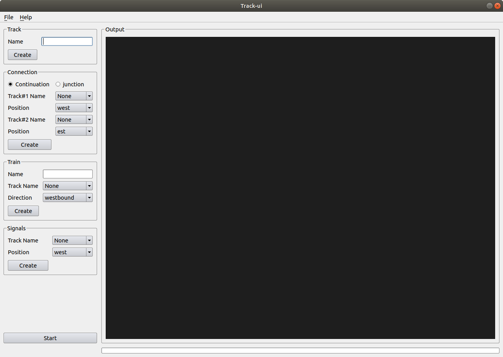

# Track-sys


### Installation

```shell
git clone git@github.com:jonathangelie/track-sys.git
```

### Documentation

html documentation can be accessible [here](https://www.jonathangelie.com/track-sys/index.html) or by using following command:

```shell
xdg-open track-sys/doc/html/index.html
```

### Core system source code

```shell
inc/
├── cmd.h
├── connection.h
├── dbg.h
├── error.h
├── event.h
├── ipc.h
├── mem.h
├── mq.h
├── signal.h
├── simulation.h
├── track.h
├── train.h
├── ui.h
└── utils.h
src/
├── cmd.c
├── connection.c
├── dbg.c
├── event.c
├── ipc.c
├── main.c
├── Makefile
├── mem.c
├── mq.c
├── signal.c
├── simulation.c
├── track.c
├── train.c
└── ui.c
```

### Graphical interface



```shell
ui/
├── cmd.py
├── __init__.py
├── ipc.py
└── ui.py
```

## Coding style

[Linux kernel coding sytle](https://www.kernel.org/doc/html/v4.10/process/coding-style.html).

## License

GPL-3.0 - <https://opensource.org/licenses/GPL-3.0>

## Author
Jonathan Gelie <[contact@jonathangelie.com](mailto:contact@jonathangelie.com)>
